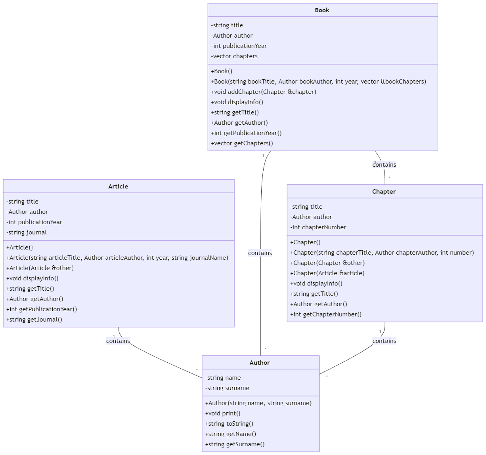

## Zadanie: Implementacja klas `Author`, `Article`, `Chapter` i `Book`

## Cel zadania
Zaimplementuj klasy zgodzie z diagramem klas



i testami jednostkowymi umieszczonymi w:.
 - `test_author.cpp`
 - `test_article.cpp`
 - `test_chapter.cpp`
 - `test_book.cpp`

## Test
Aby uruchomić testy jednostkowe, wykonaj komendę w termnalu:
```bash
make test_author
make test_article
make test_chapter
make test_book
```
